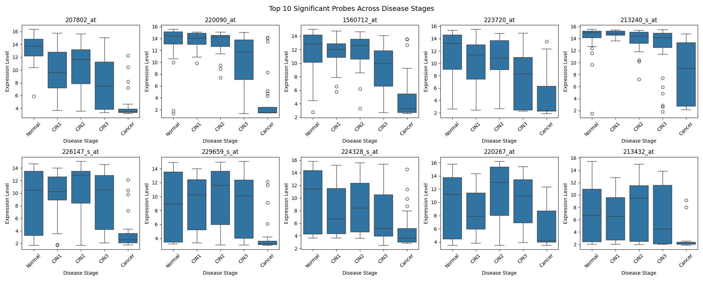

# Gene Expression Analysis in Cervical Cancer Progression
A Python-based bioinformatics pipeline for identifying differentially expressed genes across cervical cancer progression stages using the GSE63514 microarray dataset.


### Overview
Cervical cancer develops through a series of precancerous stages known as Cervical Intraepithelial Neoplasia (CIN1–CIN3) before progressing to invasive carcinoma. Understanding gene expression changes during disease progression can help identify biomarkers and biological pathways associated with cancer development.

This project analyzes gene expression data from the GEO dataset **GSE63514** to identify genes that are significantly differentially expressed across five disease stages:

- Normal
- CIN1
- CIN2
- CIN3
- Cancer

The workflow includes data preprocessing, statistical testing, post-hoc analysis, gene annotation, and visualization.


### Dataset Information

| Category | Information |
|-----------|------------|
| Source | NCBI GEO |
| Accession | GSE63514 |
| Platform | Affymetrix Human Genome U133 Plus 2.0 Array (GPL570) |
| Organism | Homo sapiens |
| Disease | Cervical Intraepithelial Neoplasia / Cervical Cancer |
| Total Samples | 128 |

### Sample Distribution

| Group | Samples |
|---------|---------|
| Normal | 24 |
| CIN1 | 14 |
| CIN2 | 22 |
| CIN3 | 40 |
| Cancer | 28 |


### Data Setup
This pipeline requires two data files that must be downloaded separately and placed in the data/ folder.
**1. GSE63514 Series Matrix**

- Go to GSE63514 on NCBI GEO
- Download the series matrix file and convert to .xlsx
- Save as data/GSE63514_series_matrix.xlsx

**2. GPL570 Platform Annotation**

- Go to GPL570 on NCBI GEO
- Download the annotation file (tab-delimited)
- Save as data/clear_annotation.csv

### Libraries used
- pandas
- matplotlib
- seaborn
- scipy 
- scikit-posthocs
- openpyxl (for reading the excel files)

### Usage
Run each script in order from the biostats/ directory. Each step depends on outputs from the previous step.
```
python3 scripts/01_daignosis.py
python3 scripts/02_check_metadata.py
python3 scripts/03_clean.py
python3 scripts/04_feature_selection.py
python3 scripts/05_shapiro.py
python3 scripts/06_krushall-wallis.py
python3 scripts/07_dunns_test.py
python3 scripts/08_ranking_results.py
python3 scripts/09_final_mapping.py
python3 scripts/10_visualise.py
```
### Pipeline Steps

| Step | Script | Description |
|------|--------|-------------|
| 1 | `01_daignosis.py` | Locates the start of expression data within the GEO series matrix |
| 2 | `02_check_metadata.py` | Verifies disease group labels and sample organisation |
| 3 | `03_clean.py` | Cleans data, extracts metadata and expression matrix, saves CSVs |
| 4 | `04_feature_selection.py` | Selects top 20 most variable probes; computes descriptive statistics |
| 5 | `05_shapiro.py` | Shapiro-Wilk normality test on each probe-group combination |
| 6 | `06_krushall-wallis.py` | Kruskal-Wallis test to identify significantly varying probes |
| 7 | `07_dunns_test.py` | Dunn's post-hoc pairwise comparisons with Bonferroni correction |
| 8 | `08_ranking_results.py` | Ranks significant probes by adjusted p-value; selects top 10 |
| 9 | `09_final_mapping.py` | Maps probe IDs to gene symbols and descriptions via GPL570 annotation |
| 10 | `10_visualise.py` | Generates individual and combined boxplots for significant probes |

### Results

The analysis identified the following top differentially expressed genes:

| Gene | Biological Role |
|------|----------------|
| CRISP3 | Immune defence; downregulated in cervical squamous cell carcinoma |
| CRNN | Epithelial differentiation; putative tumour suppressor |
| TMPRSS11B | Serine protease; tissue remodelling |
| SPINK7 | Protease inhibitor; tumour suppressor via uPA binding |
| KRT4 | Epithelial structural integrity |
| KRT24 | Epithelial structural integrity |
| PIGR | Mucosal immune defence via IgA transcytosis |
| LCE3D | Epithelial barrier function |
| MUC5B | Mucus production and epithelial protection |

Expression differences were most pronounced between the Cancer group and all pre-cancerous stages (Normal, CIN1, CIN2, CIN3).

** top 10 significant probes **


### Interpretation

Several genes involved in epithelial differentiation, mucosal immunity, and tissue integrity exhibited significant expression changes during cervical cancer progression. The strongest expression differences were observed between the Cancer group and the pre-cancerous stages, suggesting substantial transcriptomic remodeling during malignant transformation.

These findings demonstrate how publicly available gene expression datasets can be used to identify candidate biomarkers associated with disease progression and provide biological insight into cervical carcinogenesis.


## Author
Nikhitha Vujjini

M.S.Bioinformatics 
